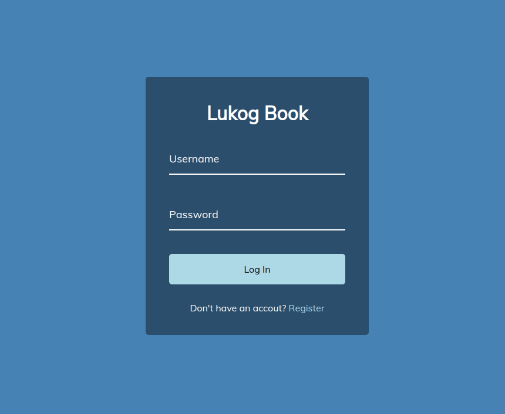
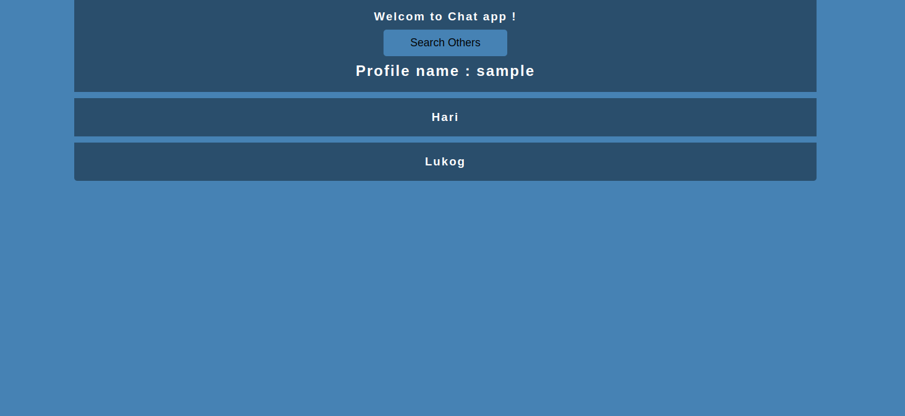

# lukogbook  
This is a social media app .  You can view other profiles and chat with others .  Chat history is stored .   Have FUN !!!  

 
 
To use the app : 
  * use this command --> pip install -r requirements.txt  
  * run the python file : dbconfig.py  
  * then run the python file : app.py  
 
Here are some screenshots of the project .  

 
Login Page :  
 

 
 

 
Profile Page :

 
 
Chatting Page : 

 
 

